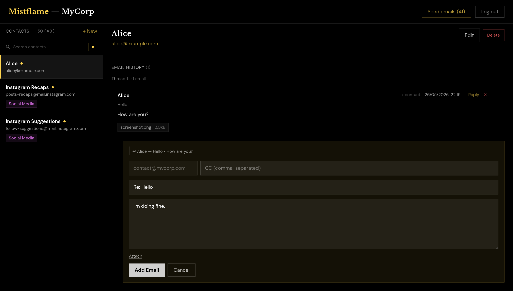

# Mistflame

Mistflame is a lightweight email manager for small-scale outreach/CRM and
personal email domains. It gives you a single organised view of your contacts
and the complete email history with each one. You can compose outbound drafts in
the UI, and inbound replies arrive automatically via Cloudflare Email Routing.



This software is intended for solo operators or small teams who need to
comprehensively manage emails and track conversations without the overhead of a
full CRM platform.

Deployed entirely on Cloudflare's infrastructure: Workers (compute), D1 (SQLite
database), KV (session storage), R2 (attachments), and Email Workers (send and
receive).

## Features

**Contacts**
- Add, edit, and delete contacts (name, email, description)
- Freeform colour-coded tags, fuzzy-searchable from the sidebar
- Awaiting-reply indicator computer per contact, filterable from the sidebar

**Email history**
- Full email log per contact, grouped by thread
- Draft emails are editable after creation
- Reply thread quote blocks are collapsed behind a toggle in the thread view
- Outgoing emails support CC (stored in DB, delivered separately per address)

**Sending**
- Send all pending drafts at once, or send individual emails inline
- Choose sender address per send; attachments supported (up to 10 MB each, sent
  as `multipart/mixed`)
- Sender email is automatically determined for replies to inbound emails
- Reply quotes blocks are automatically appended at send time
- Requires the Cloudflare Workers Paid plan (email sending is a beta feature);
  receiving and viewing emails works without it

**Receiving**
- Inbound emails matched to contacts by sender address
- Reply threading via `In-Reply-To` header matching with a subject-line fallback
- Attachments stored in R2 and shown in the UI
- Unknown senders auto-created as new contacts (name from display name, email
  from sender address)
- Optional email notification to one or more addresses when a new inbound
  message arrives (see `NOTIFY_ADDRS`)
- Configurable rate limit on inbound emails to guard against spam (see
  `RATE_LIMIT_MAX`)

**Access**
- Single-user: one password, one active session at a time
- Logging in while a session is active shows a confirmation prompt
- Optional "Remember me" checkbox persists login for 30 days

## Stack

- **Next.js 16** (App Router)
- **Cloudflare Workers**: hosting
- **Cloudflare D1**: contacts and email history
- **Cloudflare KV**: session storage and spam tracking
- **Cloudflare R2**: email attachments
- **Cloudflare Email Workers**: sending and receiving emails

## Setup

### 1. Clone and install

```bash
git clone https://github.com/Swarthe/mistflame
cd mistflame
npm install
cp wrangler.toml.example wrangler.toml
cp email-receiver/wrangler.toml.example email-receiver/wrangler.toml
```

`wrangler.toml` and `email-receiver/wrangler.toml` are gitignored; the
`.example` files are the tracked templates. You will fill in the IDs as you
create Cloudflare resources below.

### 2. KV namespace

```bash
npx wrangler kv namespace create SESSION
```

Copy the returned ID into `wrangler.toml` under `[[kv_namespaces]]`.

### 3. D1 database

```bash
npx wrangler d1 create mistflame-db
```

Copy the returned database ID into `wrangler.toml`, then apply the schema:

```bash
npx wrangler d1 execute mistflame-db --remote --file db/schema.sql
```

### 4. R2 bucket

```bash
npx wrangler r2 bucket create mistflame-attachments
```

No ID needed, R2 bindings reference the bucket by name.

### 5. Email routing

Email routing must be enabled on the domain before any email bindings work.

**Cloudflare Dashboard -> [your domain] -> Email -> Email Routing -> Enable**

Cloudflare will add the required MX records automatically.

**Receiving:** route inbound email to the worker for each address you want to
receive on:
- Email Routing -> Routes -> Add rule: **Custom address** (e.g. `hello@yourdomain.com`)
  -> **Send to Worker** -> `mistflame-email-receiver`

Alternatively, use a **Catch-all** rule to receive on all addresses for the
domain (useful if you want replies to any address to land in Mistflame, or if
you have not set up individual addresses).

To receive on multiple domains, enable Email Routing on each domain and add the
same per-address or catch-all route pointing to the same worker.

**Sending:** the `send_email` binding works for any address on any domain that
has Email Routing active, no per-address verification needed. Add multiple
addresses to `SEND_ADDRS` (comma-separated) to send from different domains.

> **Note:** outbound email sending via `EMAIL_SENDER` requires the **Cloudflare
> Workers Paid plan**; it is a beta feature not available on the free tier.
> Receiving inbound emails, storing them, and viewing the full UI all work
> without it; only the send action will fail if the binding is unavailable.

### 6. Security

Mistflame serves `robots.txt` with `Disallow: /` for all user agents, and sets
`X-Robots-Tag: noindex, nofollow` on all HTML responses via `middleware.ts`.
This prevents search engines and crawlers from indexing the app.

The login endpoint (`/api/auth`) uses a constant-time comparison for password
verification to prevent timing-based enumeration.

Inbound email attachments are capped at 10 MB each; oversized attachments are
silently dropped. Draft and sent email bodies are limited to 100,000 characters
and subjects to 500 characters.

**Recommended:** add a Cloudflare WAF rate limiting rule to prevent brute force
attacks:

1. Dashboard -> Security -> WAF -> Rate limiting rules -> Create rule
2. Fields: **Hostname** equals `your-domain.com` **AND** **URI Path** starts with `/api`
3. Threshold: 20 requests per 10 seconds per IP (example)
4. Action: Block, Duration: 10 seconds

Scoping by hostname matters if other workers share the same Cloudflare zone; a
plain `/api/*` rule also rate-limits API routes on those workers.

## Configuration

All branding and addresses are set as `[vars]` in `wrangler.toml`, no code
changes needed to customise the app for a new deployment.

### Main worker (`wrangler.toml`)

| Var | Default | Purpose |
|---|---|---|
| `ORG_NAME` | `""` | Organisation/project name; when set, shown in the UI as "Mistflame - {ORG_NAME}" and used as the display name in email `From:` headers; leave empty to show "Mistflame" only |
| `SEND_ADDRS` | `"hello@example.com"` | Comma-separated list of sender addresses available in the UI |
| `SESSION_TTL_HOURS` | `"24"` | Server-side KV expiry for the session token; the browser cookie is a session cookie (no max-age), so the session always ends when the browser closes |
| `REMEMBER_TTL_DAYS` | `"30"` | Lifetime of the remember-me cookie and its KV token in days |

### Email receiver worker (`email-receiver/wrangler.toml`)

| Var | Default | Purpose |
|---|---|---|
| `NOTIFY_ADDRS` | `""` | Comma-separated list of addresses to email when a new inbound message arrives; leave empty to disable |
| `RATE_LIMIT_MAX` | `"30"` | Soft limit on inbound emails per window (`0` = disabled); requires the `KV` binding. Enforced via a KV counter; not a hard guarantee, but effective against sustained spam |
| `RATE_LIMIT_WINDOW_MINUTES` | `"60"` | Window length in minutes for the rate limit |

### Bindings

| Binding | Type | Purpose |
|---|---|---|
| `DB` | D1 Database | Contacts and email history |
| `SESSION` | KV Namespace | Active session token (1-day TTL) |
| `ATTACHMENTS` | R2 Bucket | Inbound and outbound email attachments |
| `EMAIL_SENDER` | Send Email | Outbound email via Cloudflare Email Workers |
| `KV` | KV Namespace | Rate limit counters (email receiver only; can share the `SESSION` namespace) |
| `PASSWORD` | Secret | Login password |

## Deployment

### 1. Set password

```bash
npx wrangler secret put PASSWORD
```

> **Warning:** if `PASSWORD` is not set, the site is unprotected; anyone can log in by submitting an empty password.

### 2. Deploy main worker

```bash
npm run deploy
```

### 3. Deploy email receiver worker

The inbound worker has its own `wrangler.toml` and must be deployed separately:

```bash
npx wrangler deploy --config email-receiver/wrangler.toml
```

Redeploy this worker whenever `email-receiver/index.ts` changes (`npm run
deploy` only redeploys the main worker).

## Development

For local development, copy `.dev.vars.example` to `.dev.vars` and fill in
values. Secrets are never stored in config files.

```bash
cp .dev.vars.example .dev.vars      # fill in values
npm run dev                         # local Next.js dev server (no CF bindings)
npm run preview                     # Cloudflare Workers preview with local binding simulators
npm run preview:remote              # Cloudflare Workers preview against real remote bindings
```

The local D1 database is created automatically on first run. Apply the schema
and optionally seed it with example contacts and email threads for testing:

```bash
# Apply schema
npx wrangler d1 execute DB --local --file db/schema.sql

# Seed with example data (2 contacts, 3 threads covering all email states)
npx wrangler d1 execute DB --local --file db/seed-local.sql

# Reset all data
npx wrangler d1 execute DB --local --command "DELETE FROM email; DELETE FROM contact; DELETE FROM tag; DELETE FROM contact_tag; DELETE FROM sqlite_sequence WHERE name IN ('email','contact','tag');"
```

All `wrangler d1` commands use the binding name `DB` (not the database name) and
must be run from the project root. Local state is stored in
`.wrangler/state/v3/d1/` (gitignored); delete that directory to fully reset the
database.

## Limitations and missing features

Contributions and feature requests are welcome. The following features are not
currently implemented.

- **HTML email rendering**: inbound emails are displayed as plain text; HTML
  parts are not rendered
- **Full email search**: no full-text search across email bodies or subjects
- **Contact import/export**: no CSV or vCard import/export
- **Pagination**: long contact lists and email histories are loaded in full
- **Email templates / LLM integration**: no reusable draft templates or LLM
  support for reply generation
- **Scheduled sending**: no support for sending emails at a scheduled time
- **Multi-user access**: single-user only by design; no role-based access or
  shared sessions

## Notes

- The `middleware.ts` deprecation warning during builds is expected and
  harmless, `@opennextjs/cloudflare` 1.x requires this convention
- D1 FK constraints are declared in the schema but not enforced at runtime;
  cascading deletes are handled manually in route handlers
- To apply incremental schema changes to an existing deployment, use `--file`
  for SQL files, or `--command "ALTER TABLE ..."` for single statements:
  ```bash
  npx wrangler d1 execute mistflame-db --remote --command "ALTER TABLE email ADD COLUMN notes TEXT"
  ```

## License

Copyright (C) 2026 Emil A. Overbeck `<emil.a.overbeck at gmail dot com>`.

This file is part of `Mistflame`.

This software is free software: you can redistribute it and/or modify it under
the terms of the GNU Affero General Public License as published by the Free
Software Foundation, either version 3 of the License, or (at your option) any
later version.

This program is distributed in the hope that it will be useful, but WITHOUT ANY
WARRANTY; without even the implied warranty of MERCHANTABILITY or FITNESS FOR A
PARTICULAR PURPOSE.  See the GNU Affero General Public License for more details.

You should have received a copy of the GNU Affero General Public License along
with this program.  If not, see <https://www.gnu.org/licenses/>.
